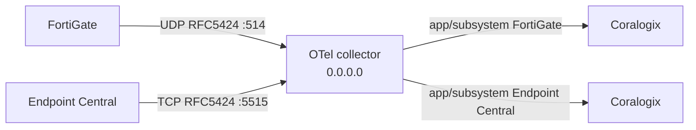

# Syslog -> Coralogix (Docker Compose)

OpenTelemetry Collector that accepts RFC5424 Syslog from FortiGate and
ManageEngine Endpoint Central (Desktop Central), then forwards each source to
its own Coralogix application/subsystem.

No custom OTel parsing, operators, or processors. Coralogix parses the records.

Screenshots for Windows Firewall, FortiGate, and Endpoint Central are in the
Word guide only:
`Syslog-FortiGate-EndpointCentral-Coralogix-Docker-Compose-Guide.docx`.



Host ports default to **UDP `514`** (FortiGate) and **TCP `5515`** (Endpoint
Central) in `.env.example`. Compose publishes on **`0.0.0.0`** so remote
sources can reach this host.

Inside the container the collector still listens on unprivileged **5514/udp**
and **5515/tcp**. Compose maps `host:514 → container:5514/udp` so FortiGate can
use the standard syslog port without binding privileged ports inside the image.

## Requirements

- Docker with Compose v2 (or Podman Desktop).
- A Coralogix Send-Your-Data API key.
- Your Coralogix domain (for example `ap3.coralogix.com`).
- Network path from each source to this host:
  - FortiGate: UDP to `FORTIGATE_SYSLOG_UDP_PORT` (default `514`).
  - Endpoint Central: TCP to `ENDPOINT_CENTRAL_SYSLOG_TCP_PORT` (default `5515`).
- Endpoint Central **11.4.2524.01** or later (Syslog integration).
- FortiGate remote Syslog format **RFC5424**, transport **UDP**, port **514**.

## Files

| File | Purpose |
|---|---|
| `compose.yaml` | Collector service, `0.0.0.0` published ports, Docker secret |
| `config.yaml` | Two RFC5424 receivers, two Coralogix exporters, no operators |
| `.env.example` | Non-secret settings + path to the key file |
| `Syslog-FortiGate-EndpointCentral-Coralogix-Docker-Compose-Guide.docx` | Customer Word guide (includes screenshots) |

## Suggested order

1. Prepare key + `.env`
2. Start Compose
3. Open host firewall (required for remote sources on Windows)
4. Configure FortiGate
5. Configure Endpoint Central
6. Verify in Coralogix

## 1. Prepare the key

Keep the Send-Your-Data key in a host file, mode `0600`. **One line, key only**
(the `cxtp_…` / Send-Your-Data value). Never commit it.

If Coralogix gave you a JSON key export, do **not** point `CORALOGIX_KEY_FILE`
at that JSON. Extract `apiKey.keyValue` into a one-line file instead — the
distroless collector reads the file as the Authorization header via
`${file:/run/secrets/coralogix_key}`.

```sh
chmod 600 /path/to/coralogix-send-data-key
```

## 2. Configure `.env`

```sh
cp .env.example .env
```

Set:

- `CORALOGIX_DOMAIN`
- `CORALOGIX_KEY_FILE` (absolute host path)
- `CORALOGIX_FORTIGATE_APPLICATION` / `CORALOGIX_FORTIGATE_SUBSYSTEM`
- `CORALOGIX_ENDPOINT_CENTRAL_APPLICATION` / `CORALOGIX_ENDPOINT_CENTRAL_SUBSYSTEM`
- ports, if the defaults are already in use (`FORTIGATE_SYSLOG_UDP_PORT=514` by default)

Do not put the key value in `.env`.

## 3. Start Compose

```sh
docker compose --env-file .env config
docker compose --env-file .env up -d
docker compose --env-file .env ps
docker compose --env-file .env logs -f syslog-collector
```

`docker compose config` must show host bind `0.0.0.0:514→5514/udp` (or your
FortiGate port) and `0.0.0.0:5515→5515/tcp` (or your Endpoint Central port).
It must not print the API key.

Publishing host UDP `514` may require Docker Desktop or a privileged Podman
setup; rootless Podman often cannot bind ports below 1024.

## 4. Open host firewall ports

Docker publishes on `0.0.0.0`, but the OS (or cloud security group) can still
block inbound Syslog. Open the same ports as in `.env`. Skip only for localhost
replay.

### Linux (ufw)

```sh
sudo ufw allow 514/udp comment 'FortiGate syslog'
sudo ufw allow 5515/tcp comment 'Endpoint Central syslog'
sudo ufw status
```

### Linux (firewalld)

```sh
sudo firewall-cmd --permanent --add-port=514/udp
sudo firewall-cmd --permanent --add-port=5515/tcp
sudo firewall-cmd --reload
sudo firewall-cmd --list-ports
```

### macOS (pf)

```sh
sudo tee /etc/pf.anchors/coralogix-syslog >/dev/null <<'EOF'
pass in proto udp from any to any port 514
pass in proto tcp from any to any port 5515
EOF
echo 'load anchor "coralogix-syslog" from "/etc/pf.anchors/coralogix-syslog"' | sudo tee -a /etc/pf.conf
sudo pfctl -f /etc/pf.conf
sudo pfctl -e
sudo pfctl -s anchors
```

Docker Desktop on the same Mac already accepts localhost replay without pf.

### Windows (GUI — recommended)

Run these steps on the Windows host that runs Docker Compose. Screenshots are
in the Word guide.

1. Start → search **Windows Defender Firewall with Advanced Security** → open it.
2. Select **Inbound Rules** → **New Rule…**.
3. Rule Type → **Port** → Next.
4. **UDP** → Specific local ports → `514` → Next.
5. **Allow the connection** → Next → enable Domain/Private/Public as needed → Next.
6. Name: `FortiGate syslog UDP 514` → Finish.
7. Repeat New Rule for **TCP** port `5515`, name `Endpoint Central syslog TCP 5515`.

### Windows (elevated Command Prompt)

```bat
netsh advfirewall firewall add rule name="FortiGate syslog UDP 514" dir=in action=allow protocol=UDP localport=514
netsh advfirewall firewall add rule name="Endpoint Central syslog TCP 5515" dir=in action=allow protocol=TCP localport=5515
```

Also allow the same ports on any cloud NSG / security group in front of this host.

## 5. Configure FortiGate

Do this **after** Compose is up and the firewall allows UDP `514`.

Point FortiGate at this host’s reachable IP (the Windows/Linux host running
Compose), not `127.0.0.1`.

### GUI (enable + server IP)

1. Log into FortiGate.
2. **Log & Report** → **Log Settings** (FortiOS 7.4+: **Log Settings → Global Settings → Syslog Logging**).
3. Enable **Send Logs to Syslog**.
4. Enter the Syslog collector IP (this Compose host).
5. **Apply**.

GUI sets the server IP; FortiGate often defaults to UDP/514. Confirm format
**RFC5424** with CLI (GUI alone may leave the default format).

### CLI (required for RFC5424; port 514 matches this template)

Match syntax to your FortiOS version. Multi-VDOM: run in the global VDOM.

```
config log syslogd setting
    set status enable
    set server "<COMPOSE_HOST_IP>"
    set mode udp
    set port 514
    set format rfc5424
end
```

Optional connectivity check from FortiGate:

```
execute ping <COMPOSE_HOST_IP>
diagnose log test
```

Screenshots: Word guide. Official tip:
https://community.fortinet.com/fortigate-3/technical-tip-how-to-configure-syslog-on-fortigate-177925

## 6. Configure Endpoint Central (Desktop Central)

Requires build **11.4.2524.01+**. Do this **after** Compose is up and the
firewall allows TCP `5515`.

1. Web console → **Admin → Integrations → All Integrations**.
2. Search **Syslog** → **Configure**.
3. Set:
   - **Syslog Server Address**: this Compose host IP
   - **Protocol**: `TCP`
   - **TLS Enabled**: off (this template)
   - **Server Port**: `5515` (or your `.env` value)
4. **Save**.
5. If a trust-certificate dialog appears (TLS only), verify as needed — not used when TLS is off.
6. Confirm consent (**Yes, Proceed**) to share Action Log Viewer data.

Screenshots: Word guide. Official help:
https://www.manageengine.com/products/desktop-central/help/integration/integrate-with-syslog.html

## 7. Verify delivery (read-only)

Compose does not use `cx`. After sources send, query the same tenant/region:

```sh
cx logs "source logs | filter \$l.applicationname == '<fortigate-application>' | filter \$l.subsystemname == '<fortigate-subsystem>' | limit 20" \
  --start now-30m --end now --tier frequent -o json --read-only
```

```sh
cx logs "source logs | filter \$l.applicationname == '<endpoint-central-application>' | filter \$l.subsystemname == '<endpoint-central-subsystem>' | limit 20" \
  --start now-30m --end now --tier frequent -o json --read-only
```

Separate:

- **Delivery** — collector logs show export without auth/config errors.
- **Visibility** — records appear in the matching application/subsystem.
- **Parsing** — Coralogix parsing rules/extensions, not this collector.

FortiGate records must not land in the Endpoint Central application, and the reverse.

## 8. Restart / stop

```sh
docker compose --env-file .env restart
docker compose --env-file .env down
```

This collector does not persist a local event queue. Source-side retry is
required if the collector is down.

## Troubleshooting

| Symptom | Likely cause | Action |
|---|---|---|
| Compose fails on `:?` | Missing `.env` value | Fill every required variable |
| `/bin/sh` not found (Podman/Docker) | Distroless image + shell entrypoint | Use default `/otelcol-contrib` + `${file:/run/secrets/coralogix_key}` |
| `bind: permission denied` on host 514 | Rootless Podman / no privilege for ports &lt; 1024 | Use Docker Desktop, or set `FORTIGATE_SYSLOG_UDP_PORT` to an unprivileged port (e.g. 5514) |
| Permission denied on secret | Key file unreadable | `chmod 600` the key file; check path |
| Auth/export errors with `${file:…}` | Key file is JSON export or has newlines | One-line Send-Your-Data value only (`apiKey.keyValue`) |
| `authorization` non-printable ASCII | Whole JSON mounted as private_key | Strip to one-line key |
| Connection refused (Endpoint Central) | TCP port/firewall | Confirm host TCP `5515` inbound allow |
| No FortiGate records | UDP blocked, wrong IP, or not RFC5424 | Confirm `0.0.0.0:514→5514/udp`, CLI `format rfc5424`, firewall UDP 514 |
| RFC5424 parse errors | Source not RFC5424 | Fix source format; do not add OTel operators |
| Coralogix 401/403 | Wrong key or domain | Check Send-Your-Data key and region domain |
| Mixed sources in one app | Shared application/subsystem | Use distinct `.env` names per source |

## Security notes

- The image is the public contrib collector (distroless; no shell). The key is a
  read-only Docker/Podman secret, expanded in config via `${file:/run/secrets/coralogix_key}`.
- `.env` and the key file must never be committed.
- TLS on the Syslog listeners is off in this template.
- Compose binds published ports on `0.0.0.0` — restrict with host firewall / NSG.

## Sources

- Coralogix: Syslog using OpenTelemetry
- Coralogix: OpenTelemetry using Docker
- OpenTelemetry Collector Contrib Syslog receiver (`protocol: rfc5424`, TCP/UDP)
- ManageEngine Endpoint Central Syslog integration (RFC5424, TCP or UDP, 11.4.2524.01+)
- FortiOS syslogd: `mode udp`, format `rfc5424`, port `514`
- Fortinet community: Technical Tip — configure syslog on FortiGate
