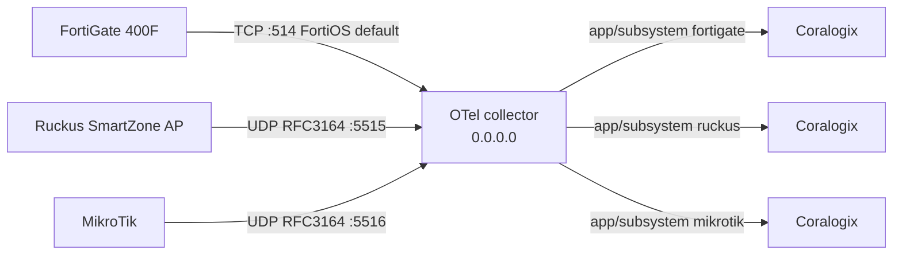

# Syslog -> Coralogix (Docker Compose, TAP)

OpenTelemetry Collector that accepts Syslog from FortiGate 400F, Ruckus
SmartZone AP, and MikroTik, then forwards each source to its own Coralogix
application/subsystem.

Coralogix parses the records — the collector only transports them. The single
exception is a `memory_limiter` and a `batch` processor, which exist purely to
survive firewall volume (see §5 and Troubleshooting).

## Clone the repository

```sh
git clone --branch tap --single-branch git@github.com:qibal-act/syslog-cx.git
cd syslog-cx
```



Host ports default to **TCP `514`** (FortiGate) and **UDP `5515` / `5516`**
(Ruckus, MikroTik) in `.env.example`. Compose publishes on **`0.0.0.0`** so remote
sources can reach this host.

## Requirements

- Docker with Compose v2 (or Podman Desktop).
- A Coralogix Send-Your-Data API key.
- Your Coralogix domain (for example `ap3.coralogix.com`).
- Network path from each source to this host (2 UDP, 1 TCP):
  - FortiGate 400F: **TCP** to `FORTIGATE_SYSLOG_PORT` (default `514`).
  - Ruckus SmartZone AP: UDP to `RUCKUS_SYSLOG_UDP_PORT` (default `5515`).
  - MikroTik: UDP to `MIKROTIK_SYSLOG_UDP_PORT` (default `5516`).
- FortiGate remote Syslog: `set mode reliable` (TCP) with the **default** FortiOS
  format. The receiver uses `protocol: none`, so FortiGate does **not** need to be
  switched to RFC5424 — Coralogix parses the Fortinet key=value format.
- Collector image **>= 0.155**: the FortiGate receiver uses `protocol: none`, which
  older releases reject (`0.149` accepts only `rfc3164` / `rfc5424`).
- Resources: **2 CPU / 1.5 GB**. A firewall logging full traffic volume emits
  ~1,000 records/s (~60M/day); the 512 MB default is OOM-killed within minutes.
- Ruckus syslog protocol **UDP** (SmartZone supports TCP or UDP; this template uses UDP).
- MikroTik `/system logging action` remote with `remote-log-format=syslog` (BSD);
  RouterOS sends syslog-format remote logs over **UDP only**.

## Files

| File | Purpose |
|---|---|
| `compose.yaml` | Collector service, `0.0.0.0` published ports, Docker secret |
| `config.yaml` | Three receivers, three Coralogix exporters, `memory_limiter` + `batch` |
| `.env.example` | Non-secret settings + path to the key file |

## Suggested order

1. Clone the `tap` branch
2. Prepare key + `.env`
3. Start Compose
4. Open host firewall (§4)
5. Configure FortiGate 400F (§5)
6. Configure Ruckus SmartZone (§6)
7. Configure MikroTik (§7)
8. Verify in Coralogix (§8)

## 1. Prepare the key

Keep the Send-Your-Data key in a host file. **One line, key only** (the `cxtp_…` /
Send-Your-Data value). Never commit it.

If Coralogix gave you a JSON key export, do **not** point `CORALOGIX_KEY_FILE` at
that JSON — the collector fails with
`"authorization" contains value with non-printable ASCII characters`.

```sh
# extract just the key (no trailing newline)
jq -r '.apiKey.keyValue' key.json | tr -d '\n' > /opt/coralogix-send-data-key

# the collector container runs as uid/gid 10001 and must be able to read it
chown root:10001 /opt/coralogix-send-data-key
chmod 640 /opt/coralogix-send-data-key

# verify the shape (never print the value)
wc -c < /opt/coralogix-send-data-key                      # expect ~35
tr -cd '\n' < /opt/coralogix-send-data-key | wc -c         # expect 0 (no newline)
```

The file is bind-mounted at `/run/secrets/coralogix_key` and read via
`${file:/run/secrets/coralogix_key}` (the distroless image has no shell, so this is
not a shell wrapper). Because it is read as container user **10001**, a root-owned
`chmod 600` file fails with a permission error — use `640` with group `10001`.

## 2. Configure `.env`

```sh
cp .env.example .env
```

Set:

- `CORALOGIX_DOMAIN`
- `CORALOGIX_KEY_FILE` (absolute host path)
- `CORALOGIX_FORTIGATE_APPLICATION` / `CORALOGIX_FORTIGATE_SUBSYSTEM`
- `CORALOGIX_RUCKUS_APPLICATION` / `CORALOGIX_RUCKUS_SUBSYSTEM`
- `CORALOGIX_MIKROTIK_APPLICATION` / `CORALOGIX_MIKROTIK_SUBSYSTEM`
- ports, if the defaults are already in use

Do not put the key value in `.env`.

## 3. Start Compose

```sh
docker compose --env-file .env config
docker compose --env-file .env up -d
docker compose --env-file .env ps
docker compose --env-file .env logs -f syslog-collector
```

`docker compose config` must show two UDP bindings (`5515`, `5516`) and one TCP
binding (`514`), and must not print the API key.

## 4. Open host firewall ports

Docker publishes on `0.0.0.0`, but the OS (or cloud security group) can still
block inbound Syslog. Open the same ports as in `.env`. Skip only for localhost
replay.

### Linux (ufw)

```sh
sudo ufw allow 514/tcp comment 'FortiGate syslog'
sudo ufw allow 5515/udp comment 'Ruckus syslog'
sudo ufw allow 5516/udp comment 'MikroTik syslog'
sudo ufw status
```

### Linux (firewalld)

```sh
sudo firewall-cmd --permanent --add-port=514/tcp
sudo firewall-cmd --permanent --add-port=5515/udp
sudo firewall-cmd --permanent --add-port=5516/udp
sudo firewall-cmd --reload
sudo firewall-cmd --list-ports
```

### macOS (pf)

```sh
sudo tee /etc/pf.anchors/coralogix-syslog >/dev/null <<'EOF'
pass in proto tcp from any to any port 514
pass in proto udp from any to any port 5515
pass in proto udp from any to any port 5516
EOF
echo 'load anchor "coralogix-syslog" from "/etc/pf.anchors/coralogix-syslog"' | sudo tee -a /etc/pf.conf
sudo pfctl -f /etc/pf.conf
sudo pfctl -e
```

Docker Desktop on the same Mac already accepts localhost replay without pf.

### Windows (GUI)

1. Start → **Windows Defender Firewall with Advanced Security**.
2. **Inbound Rules** → **New Rule…** → **Port** → **TCP**, port `514` (repeat for
   **UDP** ports `5515, 5516`).
3. **Allow the connection** → enable profiles as needed → name it (e.g.
   `TAP syslog TCP 514 + UDP 5515-5516`).

### Windows (elevated Command Prompt)

```bat
netsh advfirewall firewall add rule name="TAP FortiGate syslog TCP 514" dir=in action=allow protocol=TCP localport=514
netsh advfirewall firewall add rule name="TAP Ruckus syslog UDP 5515" dir=in action=allow protocol=UDP localport=5515
netsh advfirewall firewall add rule name="TAP MikroTik syslog UDP 5516" dir=in action=allow protocol=UDP localport=5516
```

Also allow the same ports on any cloud NSG / security group in front of this host.

## 5. Configure FortiGate 400F

Do this **after** Compose is up and the firewall allows TCP `514`.

Point FortiGate at this host's reachable IP, not `127.0.0.1`.

Match CLI syntax to your FortiOS version. Multi-VDOM: run in the global VDOM.

```
config log syslogd setting
    set status enable
    set server "<COMPOSE_HOST_IP>"
    set mode reliable        # reliable = TCP
    set port 514
    set format default       # FortiOS key=value; keep the default
end
```

**Why the default format.** `syslog/fortigate` uses `protocol: none`, so the raw
FortiOS line is passed through untouched (a leading `<PRI>` is still decoded) and
Coralogix performs the Fortinet parsing. This avoids the two failure modes that
break a naive RFC5424 setup:

- FortiOS `format default` is **not** RFC5424. A receiver set to `protocol: rfc5424`
  rejects every record with
  `expecting a priority value within angle brackets [col 0]`.
- FortiOS reliable/TCP frames messages with RFC 6587 **octet counting**
  (`<len> <msg>`). The receiver only honours that with
  `enable_octet_counting: true`; the collector default is `false`.

If change control requires RFC5424 instead: set `set format rfc5424`, keep
`enable_octet_counting: true`, and switch the receiver to `protocol: rfc5424`
(remove the `protocol: none` line). Never leave the receiver on RFC5424 while
FortiGate sends the default format.

Optional connectivity check from FortiGate:

```
execute ping <COMPOSE_HOST_IP>
diagnose log test
```

Confirm the records reach this host before blaming Coralogix:

```sh
sudo tcpdump -i <iface> -n -c 10 "tcp and port 514"
```

## 6. Configure Ruckus SmartZone AP

Do this **after** Compose is up and the firewall allows UDP `5515`.

1. SmartZone web UI → **System → General Settings → Syslog**: enable
   **logging to remote syslog server**.
2. Primary server address = this Compose host IP, port `5515`, protocol **UDP**.
3. For AP-level external syslog (per zone): enable the external syslog server
   option, same host / port `5515` / UDP.
4. Ping the syslog server from the UI; expect Success.

If the controller is set to TCP instead, either switch it to UDP or add a TCP
receiver for port 5515 in `config.yaml` (one transport per receiver).

## 7. Configure MikroTik

Do this **after** Compose is up and the firewall allows UDP `5516`.

RouterOS sends `syslog`-format remote logs over UDP only (TCP/TLS apply to CEF
only), so keep UDP on both ends:

```
/system logging action add name=remote-coralogix target=remote \
    remote=<COMPOSE_HOST_IP> remote-port=5516 \
    remote-log-format=syslog syslog-facility=daemon
/system logging add topics=info action=remote-coralogix
/system logging add topics=warning action=remote-coralogix
/system logging add topics=error action=remote-coralogix
/system logging add topics=critical action=remote-coralogix
```

Adjust topics to taste (`firewall`, `account`, `wireless`, …). Keep
`remote-log-format=syslog` so the payload stays BSD-syslog (RFC3164), matching
the `syslog/mikrotik` receiver. Do **not** select `default` or `cef`.

**Timezone — required.** RFC3164 timestamps carry no timezone, so the receiver
parses them with its `location` setting (default `UTC`). This template pins
`location: Asia/Jakarta` because the router clock is WIB. If the router is in a
different zone, change the receiver's `location` to match it, and keep the router
clock correct:

```
/system clock print
/system ntp client print
```

A zone mismatch is silent: the records are rejected at Coralogix ingress as
`log record(s) in the future`, which presents exactly like "logs are not
arriving".

## 8. Verify delivery (read-only)

Compose does not use `cx`. After sources send, query the same tenant/region:

```sh
cx logs "source logs | filter \$l.applicationname == '<fortigate-application>' | filter \$l.subsystemname == '<fortigate-subsystem>' | limit 20" \
  --start now-30m --end now --tier frequent -o json --read-only
```

```sh
cx logs "source logs | filter \$l.applicationname == '<ruckus-application>' | filter \$l.subsystemname == '<ruckus-subsystem>' | limit 20" \
  --start now-30m --end now --tier frequent -o json --read-only
```

```sh
cx logs "source logs | filter \$l.applicationname == '<mikrotik-application>' | filter \$l.subsystemname == '<mikrotik-subsystem>' | limit 20" \
  --start now-30m --end now --tier frequent -o json --read-only
```

Separate:

- **Delivery** — collector logs show export without auth/config errors.
- **Visibility** — records appear in the matching application/subsystem.
- **Parsing** — Coralogix parsing rules/extensions, not this collector.

Each source's records must land only in its own application/subsystem.

## 9. Restart / stop

```sh
docker compose --env-file .env restart
docker compose --env-file .env down
```

This collector does not persist a local event queue. Source-side retry is
required if the collector is down.

## Troubleshooting

**Always check the wire first** — it splits "the device never sent it" from "the
collector/Coralogix dropped it":

```sh
sudo tcpdump -i <iface> -n "tcp and port 514"     # FortiGate
sudo tcpdump -i <iface> -n "udp and port 5515"    # Ruckus
sudo tcpdump -i <iface> -n "udp and port 5516"    # MikroTik
```

Real failure signatures seen in production, in the order they bite:

| Symptom (collector log / Coralogix) | Root cause | Fix |
|---|---|---|
| No packets in tcpdump | device not sending, wrong IP, or host firewall blocking | fix at the source or the host firewall (§4) |
| `expecting a priority value within angle brackets [col 0]` | receiver `protocol` doesn't match the device's format, and/or octet counting not enabled | match `protocol` to the format; `enable_octet_counting: true` for FortiOS reliable/TCP |
| `authorization" contains value with non-printable ASCII characters` | the secret file is the Coralogix **JSON export**, not the bare key | `jq -r '.apiKey.keyValue' key.json \| tr -d '\n' > key`, one line, `chmod 600`, owner `root:10001` |
| `log record(s) in the future` / `Partial success response from Coralogix` (exporter `coralogix/mikrotik`) | RFC3164 source in a non-UTC timezone; parsed as UTC → future-dated | set `location: <IANA zone>` on that receiver; check the device clock/NTP |
| `data refused due to high memory usage` + `DeadlineExceeded` | batches too large for the export timeout at high volume | `send_batch_size` ~1024, `timeout: 60s`, more `num_consumers` |
| Container restarts every ~2 min, exit code 137 | OOM-killed at the 512 MB default | raise `mem_limit` (1.5 GB) and keep `memory_limiter` below it |
| `Compose fails on :?` | missing `.env` value | fill every required variable |
| Permission denied on secret | key file unreadable by uid/gid 10001 | `chmod 640`, owner `root:10001` |
| Coralogix 401/403 | wrong key or region domain | check Send-Your-Data key and `CORALOGIX_DOMAIN` |
| Mixed sources in one application | shared application/subsystem names | distinct `.env` names per source |

Useful one-liners:

```sh
docker logs --tail 100 syslog-coralogix-tap-syslog-collector-1 2>&1 | grep -iE "error|refused|future"
docker inspect syslog-coralogix-tap-syslog-collector-1 --format 'Restarts={{.RestartCount}}'
docker stats --no-stream syslog-coralogix-tap-syslog-collector-1
docker run --rm --env-file .env -v ./config.yaml:/c.yaml:ro \
  -v "$CORALOGIX_KEY_FILE":/run/secrets/coralogix_key:ro \
  otel/opentelemetry-collector-contrib:0.161.0 validate --config /c.yaml
```

## Security notes

- The image is the public contrib collector (distroless; no shell). The key is a
  read-only Docker/Podman secret, expanded in config via `${file:/run/secrets/coralogix_key}`.
- `.env` and the key file must never be committed.
- TLS on the Syslog listeners is off in this template.
- Compose binds published ports on `0.0.0.0` — restrict with host firewall / NSG.

## Sources

- Coralogix: Syslog using OpenTelemetry
- OpenTelemetry Collector Contrib **Syslog receiver** — options used here:
  `protocol` (`rfc3164` / `rfc5424` / `none`), `enable_octet_counting`, `max_octets`,
  `location` (RFC3164 timezone):
  https://github.com/open-telemetry/opentelemetry-collector-contrib/blob/main/receiver/syslogreceiver/README.md
- FortiOS syslogd: `mode reliable` (TCP), `format default` (key=value) — the receiver
  takes it with `protocol: none`; RFC6587 octet counting applies on TCP
- Ruckus SmartZone admin + CLI guides: remote syslog address/port, protocol TCP or UDP
- MikroTik RouterOS Log docs: remote syslog is RFC 3164 BSD format, UDP-only for syslog format
