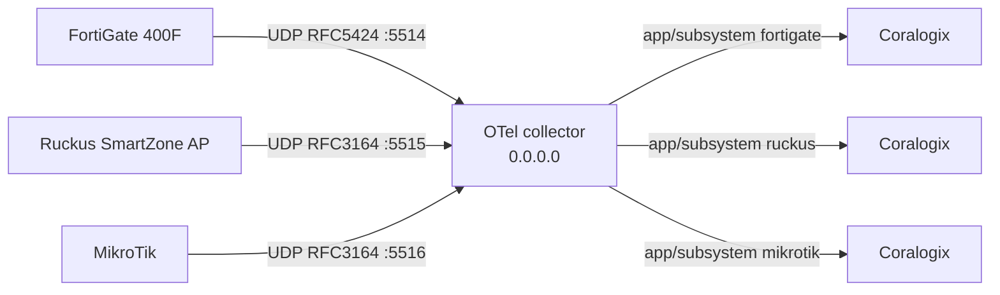

# Syslog -> Coralogix (Docker Compose, TAP)

OpenTelemetry Collector that accepts Syslog from FortiGate 400F, Ruckus
SmartZone AP, and MikroTik, then forwards each source to its own Coralogix
application/subsystem.

No custom OTel parsing, operators, or processors. Coralogix parses the records.

## Clone the repository

```sh
git clone --branch tap --single-branch git@github.com:qibal-act/syslog-cx.git
cd syslog-cx
```



Host ports default to **UDP `5514` / `5515` / `5516`** in `.env.example`.
Compose publishes on **`0.0.0.0`** so remote sources can reach this host.

## Requirements

- Docker with Compose v2 (or Podman Desktop).
- A Coralogix Send-Your-Data API key.
- Your Coralogix domain (for example `ap3.coralogix.com`).
- Network path from each source to this host (all UDP):
  - FortiGate 400F: UDP to `FORTIGATE_SYSLOG_UDP_PORT` (default `5514`).
  - Ruckus SmartZone AP: UDP to `RUCKUS_SYSLOG_UDP_PORT` (default `5515`).
  - MikroTik: UDP to `MIKROTIK_SYSLOG_UDP_PORT` (default `5516`).
- FortiGate remote Syslog format **RFC5424**, mode **udp**.
- Ruckus syslog protocol **UDP** (SmartZone supports TCP or UDP; this template uses UDP).
- MikroTik `/system logging action` remote with `remote-log-format=syslog` (BSD);
  RouterOS sends syslog-format remote logs over **UDP only**.

## Files

| File | Purpose |
|---|---|
| `compose.yaml` | Collector service, `0.0.0.0` published ports, Docker secret |
| `config.yaml` | Three receivers, three Coralogix exporters, no operators |
| `.env.example` | Non-secret settings + path to the key file |

## Suggested order

1. Clone the `tap` branch
2. Prepare key + `.env`
3. Start Compose
4. Open host firewall (§4)
5. Configure FortiGate 400F (§5)
6. Configure Ruckus SmartZone (§6)
7. Configure MikroTik (§7)
8. Verify in Coralogix (§8)

## 1. Prepare the key

Keep the Send-Your-Data key in a host file, mode `0600`. **One line, key only**
(the `cxtp_…` / Send-Your-Data value). Never commit it.

If Coralogix gave you a JSON key export, do **not** point `CORALOGIX_KEY_FILE`
at that JSON. Extract `apiKey.keyValue` into a one-line file instead — the
distroless collector reads the file as the Authorization header via
`${file:/run/secrets/coralogix_key}`.

```sh
chmod 600 /path/to/coralogix-send-data-key
```

## 2. Configure `.env`

```sh
cp .env.example .env
```

Set:

- `CORALOGIX_DOMAIN`
- `CORALOGIX_KEY_FILE` (absolute host path)
- `CORALOGIX_FORTIGATE_APPLICATION` / `CORALOGIX_FORTIGATE_SUBSYSTEM`
- `CORALOGIX_RUCKUS_APPLICATION` / `CORALOGIX_RUCKUS_SUBSYSTEM`
- `CORALOGIX_MIKROTIK_APPLICATION` / `CORALOGIX_MIKROTIK_SUBSYSTEM`
- ports, if the defaults are already in use

Do not put the key value in `.env`.

## 3. Start Compose

```sh
docker compose --env-file .env config
docker compose --env-file .env up -d
docker compose --env-file .env ps
docker compose --env-file .env logs -f syslog-collector
```

`docker compose config` must show the three UDP bindings and must not print
the API key.

## 4. Open host firewall ports

Docker publishes on `0.0.0.0`, but the OS (or cloud security group) can still
block inbound Syslog. Open the same ports as in `.env`. Skip only for localhost
replay.

### Linux (ufw)

```sh
sudo ufw allow 5514/udp comment 'FortiGate syslog'
sudo ufw allow 5515/udp comment 'Ruckus syslog'
sudo ufw allow 5516/udp comment 'MikroTik syslog'
sudo ufw status
```

### Linux (firewalld)

```sh
sudo firewall-cmd --permanent --add-port=5514/udp
sudo firewall-cmd --permanent --add-port=5515/udp
sudo firewall-cmd --permanent --add-port=5516/udp
sudo firewall-cmd --reload
sudo firewall-cmd --list-ports
```

### macOS (pf)

```sh
sudo tee /etc/pf.anchors/coralogix-syslog >/dev/null <<'EOF'
pass in proto udp from any to any port 5514
pass in proto udp from any to any port 5515
pass in proto udp from any to any port 5516
EOF
echo 'load anchor "coralogix-syslog" from "/etc/pf.anchors/coralogix-syslog"' | sudo tee -a /etc/pf.conf
sudo pfctl -f /etc/pf.conf
sudo pfctl -e
```

Docker Desktop on the same Mac already accepts localhost replay without pf.

### Windows (GUI)

1. Start → **Windows Defender Firewall with Advanced Security**.
2. **Inbound Rules** → **New Rule…** → **Port** → **UDP**, ports `5514, 5515, 5516`.
3. **Allow the connection** → enable profiles as needed → name it (e.g.
   `TAP syslog UDP 5514-5516`).

### Windows (elevated Command Prompt)

```bat
netsh advfirewall firewall add rule name="TAP FortiGate syslog UDP 5514" dir=in action=allow protocol=UDP localport=5514
netsh advfirewall firewall add rule name="TAP Ruckus syslog UDP 5515" dir=in action=allow protocol=UDP localport=5515
netsh advfirewall firewall add rule name="TAP MikroTik syslog UDP 5516" dir=in action=allow protocol=UDP localport=5516
```

Also allow the same ports on any cloud NSG / security group in front of this host.

## 5. Configure FortiGate 400F

Do this **after** Compose is up and the firewall allows UDP `5514`.

Point FortiGate at this host's reachable IP, not `127.0.0.1`.

Match CLI syntax to your FortiOS version. Multi-VDOM: run in the global VDOM.

```
config log syslogd setting
    set status enable
    set server "<COMPOSE_HOST_IP>"
    set mode udp
    set port 5514
    set format rfc5424
end
```

Optional connectivity check from FortiGate:

```
execute ping <COMPOSE_HOST_IP>
diagnose log test
```

## 6. Configure Ruckus SmartZone AP

Do this **after** Compose is up and the firewall allows UDP `5515`.

1. SmartZone web UI → **System → General Settings → Syslog**: enable
   **logging to remote syslog server**.
2. Primary server address = this Compose host IP, port `5515`, protocol **UDP**.
3. For AP-level external syslog (per zone): enable the external syslog server
   option, same host / port `5515` / UDP.
4. Ping the syslog server from the UI; expect Success.

If the controller is set to TCP instead, either switch it to UDP or add a TCP
receiver for port 5515 in `config.yaml` (one transport per receiver).

## 7. Configure MikroTik

Do this **after** Compose is up and the firewall allows UDP `5516`.

RouterOS sends `syslog`-format remote logs over UDP only (TCP/TLS apply to CEF
only), so keep UDP on both ends:

```
/system logging action add name=remote-coralogix target=remote \
    remote=<COMPOSE_HOST_IP> remote-port=5516 \
    remote-log-format=syslog syslog-facility=daemon
/system logging add topics=info action=remote-coralogix
/system logging add topics=warning action=remote-coralogix
/system logging add topics=error action=remote-coralogix
/system logging add topics=critical action=remote-coralogix
```

Adjust topics to taste (`firewall`, `account`, `wireless`, …). Keep
`remote-log-format=syslog` so the payload stays BSD-syslog (RFC3164), matching
the `syslog/mikrotik` receiver.

## 8. Verify delivery (read-only)

Compose does not use `cx`. After sources send, query the same tenant/region:

```sh
cx logs "source logs | filter \$l.applicationname == '<fortigate-application>' | filter \$l.subsystemname == '<fortigate-subsystem>' | limit 20" \
  --start now-30m --end now --tier frequent -o json --read-only
```

```sh
cx logs "source logs | filter \$l.applicationname == '<ruckus-application>' | filter \$l.subsystemname == '<ruckus-subsystem>' | limit 20" \
  --start now-30m --end now --tier frequent -o json --read-only
```

```sh
cx logs "source logs | filter \$l.applicationname == '<mikrotik-application>' | filter \$l.subsystemname == '<mikrotik-subsystem>' | limit 20" \
  --start now-30m --end now --tier frequent -o json --read-only
```

Separate:

- **Delivery** — collector logs show export without auth/config errors.
- **Visibility** — records appear in the matching application/subsystem.
- **Parsing** — Coralogix parsing rules/extensions, not this collector.

Each source's records must land only in its own application/subsystem.

## 9. Restart / stop

```sh
docker compose --env-file .env restart
docker compose --env-file .env down
```

This collector does not persist a local event queue. Source-side retry is
required if the collector is down.

## Troubleshooting

| Symptom | Likely cause | Action |
|---|---|---|
| Compose fails on `:?` | Missing `.env` value | Fill every required variable |
| Permission denied on secret | Key file unreadable | `chmod 600` the key file; check path |
| Auth/export errors with `${file:…}` | Key file is JSON export or has newlines | One-line Send-Your-Data value only (`apiKey.keyValue`) |
| No FortiGate records | UDP blocked, wrong IP, or not RFC5424 | Confirm port, CLI `mode udp` + `format rfc5424`, firewall UDP 5514 |
| No Ruckus records | Protocol mismatch or wrong port | Confirm controller protocol UDP + port 5515; receiver is UDP/RFC3164 |
| No MikroTik records | TCP selected or format is CEF/default | Keep UDP + `remote-log-format=syslog` |
| RFC5424 parse errors | Source not RFC5424 on that port | Fix source format; do not add OTel operators |
| Coralogix 401/403 | Wrong key or domain | Check Send-Your-Data key and region domain |
| Mixed sources in one app | Shared application/subsystem | Use distinct `.env` names per source |

## Security notes

- The image is the public contrib collector (distroless; no shell). The key is a
  read-only Docker/Podman secret, expanded in config via `${file:/run/secrets/coralogix_key}`.
- `.env` and the key file must never be committed.
- TLS on the Syslog listeners is off in this template.
- Compose binds published ports on `0.0.0.0` — restrict with host firewall / NSG.

## Sources

- Coralogix: Syslog using OpenTelemetry
- OpenTelemetry Collector Contrib Syslog receiver (`protocol: rfc5424` / `rfc3164`, TCP/UDP)
- FortiOS syslogd: `mode udp`, format `rfc5424`
- Ruckus SmartZone admin + CLI guides: remote syslog address/port, protocol TCP or UDP
- MikroTik RouterOS Log docs: remote syslog is RFC 3164 BSD format, UDP-only for syslog format
